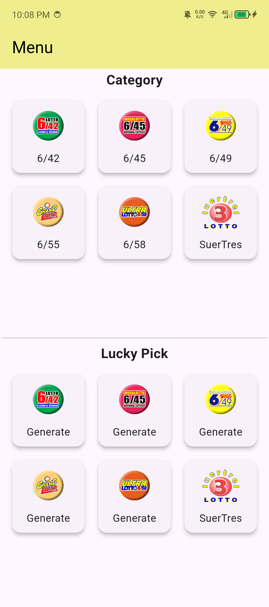
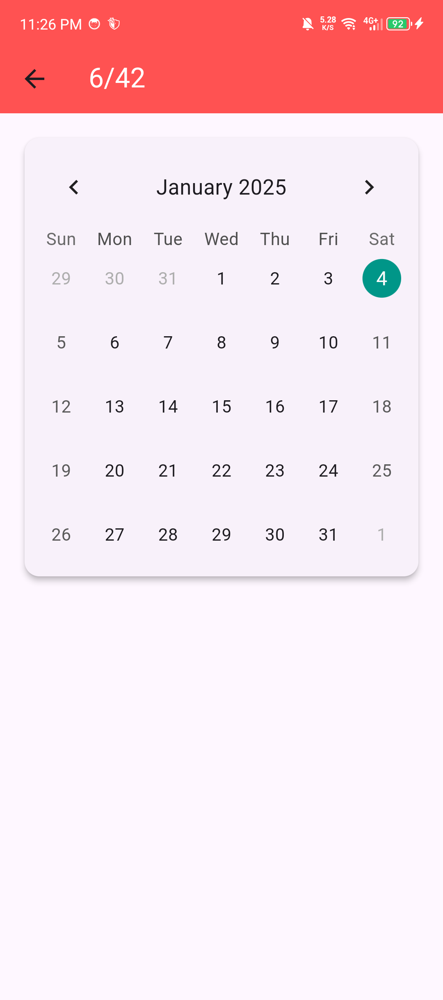
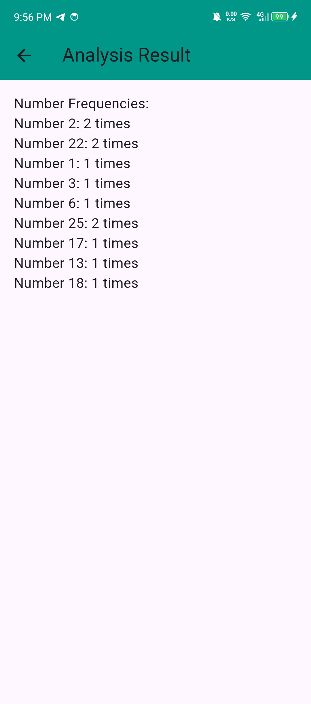

A simple mobile base application for recording lotto results and lucky number picks for different category

# LottoScope 🎰

**LottoScope** is a simple and user-friendly app designed to help you record, track, and organize lotto results effortlessly. Whether you're keeping track of your lucky numbers or analyzing past draws, LottoScope has you covered!

# App UI

   
   
   
   

## Features 🌟
- 📊 **Record Lotto Results**: Quickly input and save winning numbers from multiple draws.
- 🔍 **Search & Organize**: Easily search for past results and organize them by date.
- 📅 **Draw History**: View a chronological history of recorded lotto results.
- 📝 **Lucky Pick**: generate your lucky numbers if you don't have numbers in your mind yet.

## Getting Started 🚀
1. Download the app in github.
2. Open LottoScope and start adding your lotto results.
3. Use the search and filter options to find specific draws or analyze trends.

## Why Choose LottoScope? 🤔
- **Easy to Use**: Simple interface for quick recording.
- **Stay Organized**: Never lose track of your lotto results again.
- **Analyze Trends**: Gain insights into your favorite lotto games.

## Support 📬
If you encounter any issues or have feedback, feel free to contact us at [support@lottoscope.com](mailto:christian.barbosa05222001@gmail.com).

---

**LottoScope** – Your ultimate companion for recording and tracking lotto results! 🍀

# Notes:
1. Some of the dependencies may not available if you try to run this project in the latest flutter version.
2. Build the Project in the flutter versiob 3.18.1.
3. Higher version may not be compatible with the core packages in this projects.